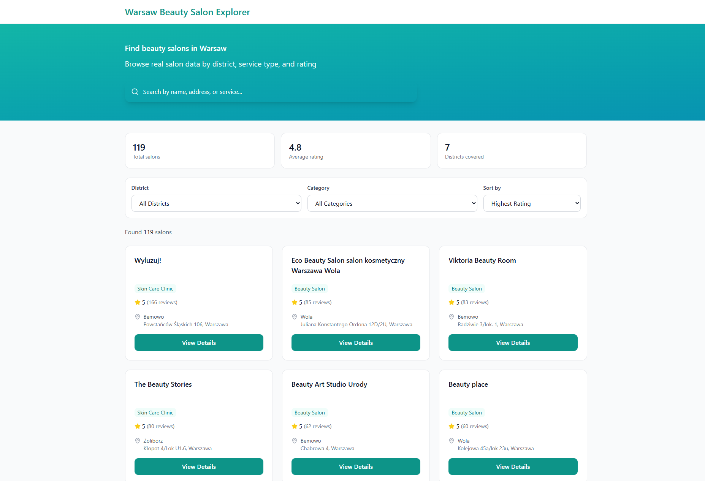
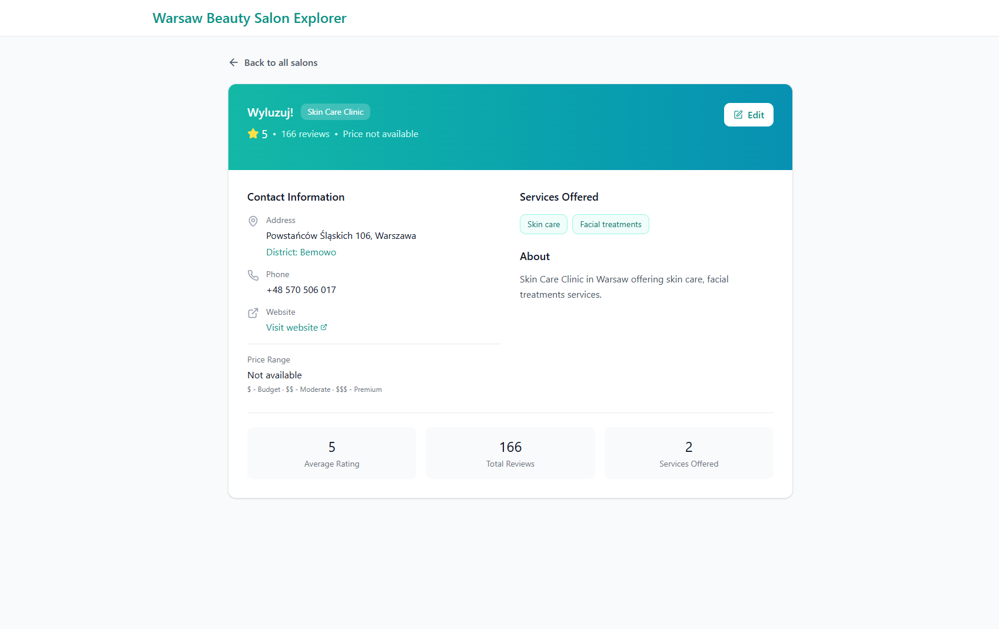
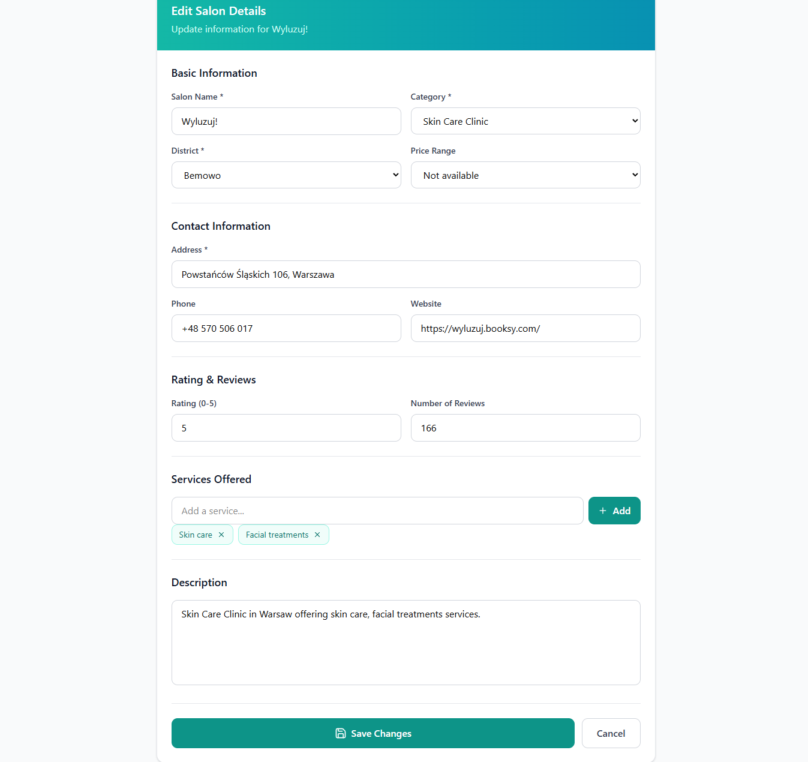

# Warsaw Beauty Salon Explorer 💇‍♀️✨

A full-stack web application for exploring beauty, hair, nail, spa, barber, and skin-care salons in Warsaw.

This project was built as a home task for the Warsaw Accelerator 2026 Software Engineer Intern application. It includes a structured salon dataset, a REST API backed by SQLite, and a React frontend with search, filtering, detail view, and edit functionality.

---

## 📸 Screenshots

> Add screenshots to the `frontend/public/screenshots` folder.

### Home / Salon Listing



### Salon Detail Page



### Edit Salon Page



---

## 🚀 Features

- Browse 100+ Warsaw beauty and hair-related salons
- Search salons by name, address, category, or service
- Filter salons by district
- Filter salons by category
- View detailed salon information
- Edit and save salon details
- Store salon data in SQLite
- Import initial data from a JSON seed file
- REST API for salon listing, details, and updates
- Responsive and clean user interface

---

## 🧾 Dataset

The application includes a dataset of 119 Warsaw salons.

Each salon record contains:

- Name
- Category
- Address
- District
- Phone number
- Website or social/profile link
- Services
- Rating
- Reviews count
- Description

Phone numbers and websites were manually enriched from publicly available sources where reliable information was available. Missing optional fields are stored as `null`.

The JSON file is used only as an initial seed source. After running the seed script, the application stores and reads data from SQLite.

```txt
JSON seed file → SQLite database → Express API → React frontend
```

---

## 🛠️ Tech Stack

### Frontend

- React
- TypeScript
- Vite
- Tailwind CSS
- Lucide React icons

### Backend

- Node.js
- Express.js
- TypeScript
- SQLite
- better-sqlite3
- CORS
- dotenv

---

## 📁 Project Structure

```txt
warsaw_beauty_salon_explorer/
├── backend/
│   ├── data/
│   │   └── salons.seed.json
│   ├── database/
│   │   └── salons.sqlite
│   ├── src/
│   │   ├── controllers/
│   │   │   └── salons.controller.ts
│   │   ├── db/
│   │   │   ├── database.ts
│   │   │   └── seed.ts
│   │   ├── routes/
│   │   │   └── salons.routes.ts
│   │   ├── types/
│   │   │   └── salon.ts
│   │   ├── app.ts
│   │   └── server.ts
│   ├── package.json
│   └── tsconfig.json
│
├── frontend/
│   ├── public/
│   │   └── screenshots/
│   ├── src/
│   │   ├── app/
│   │   │   ├── components/
│   │   │   └── App.tsx
│   │   ├── services/
│   │   │   └── salonsApi.ts
│   │   ├── types/
│   │   │   └── salon.ts
│   │   └── main.tsx
│   ├── package.json
│   └── vite.config.ts
│
└── README.md
```

---

## ⚙️ Getting Started

### 1. Clone the repository

```bash
git clone https://github.com/vahid2104/warsaw_beauty_salon_explorer.git
cd warsaw_beauty_salon_explorer
```

---

## 🔧 Backend Setup

Go to the backend folder:

```bash
cd backend
```

Install dependencies:

```bash
npm install
```

Seed the SQLite database:

```bash
npm run seed
```

Start the backend server:

```bash
npm run dev
```

The backend will run on:

```txt
http://localhost:5000
```

---

## 🎨 Frontend Setup

Open a new terminal and go to the frontend folder:

```bash
cd frontend
```

Install dependencies:

```bash
npm install
```

Create a `.env` file inside the `frontend` folder:

```env
VITE_API_URL=http://localhost:5000/api
```

Start the frontend development server:

```bash
npm run dev
```

The frontend will run on:

```txt
http://localhost:5173
```

---

## 🔌 API Endpoints

### Get all salons

```http
GET /api/salons
```

Example:

```txt
http://localhost:5000/api/salons
```

---

### Search salons

```http
GET /api/salons?search=hair
```

Example:

```txt
http://localhost:5000/api/salons?search=hair
```

---

### Filter by district

```http
GET /api/salons?district=Bemowo
```

Example:

```txt
http://localhost:5000/api/salons?district=Bemowo
```

---

### Filter by category

```http
GET /api/salons?category=Nail Salon
```

Example:

```txt
http://localhost:5000/api/salons?category=Nail%20Salon
```

---

### Get salon details

```http
GET /api/salons/:id
```

Example:

```txt
http://localhost:5000/api/salons/1
```

---

### Update salon details

```http
PUT /api/salons/:id
```

Example:

```txt
http://localhost:5000/api/salons/1
```

Example request body:

```json
{
  "name": "Example Beauty Salon",
  "category": "Beauty Salon",
  "address": "Example Street 10, Warszawa",
  "district": "Bemowo",
  "phone": "+48 123 456 789",
  "website": "https://example.com",
  "services": ["Beauty treatments", "Cosmetology"],
  "priceRange": null,
  "rating": 4.8,
  "reviewsCount": 120,
  "description": "Beauty salon in Warsaw offering beauty and cosmetic services."
}
```

---

## 🧪 Useful Scripts

### Backend

```bash
npm run dev
```

Starts the backend server in development mode.

```bash
npm run seed
```

Imports data from `salons.seed.json` into SQLite.

```bash
npm run build
```

Builds the TypeScript backend.

```bash
npm start
```

Runs the compiled backend.

---

### Frontend

```bash
npm run dev
```

Starts the frontend development server.

```bash
npm run build
```

Builds the frontend for production.

```bash
npm run preview
```

Previews the production build locally.

---

## 🗃️ Data Flow

The project uses both JSON and SQLite, but for different purposes.

```txt
1. salons.seed.json stores the initial dataset.
2. npm run seed reads the JSON file.
3. The seed script inserts the data into SQLite.
4. Express API reads salon data from SQLite.
5. React frontend communicates with the Express API.
```

So the main application database is SQLite, while JSON is used as a seed/import file.

---

## 🧠 Implementation Notes

- The salon list endpoint supports search and filtering through query parameters.
- Services are stored in SQLite as a JSON string and parsed before sending the response.
- Optional fields such as `phone`, `website`, and `priceRange` can be `null`.
- The edit page updates one salon record through a `PUT` request.
- The frontend is separated from the backend for a clear full-stack structure.

---

## ✅ Current Status

- Backend API completed
- SQLite database integration completed
- JSON seed import completed
- 119 salons added
- Search and filters completed
- Detail page completed
- Edit page completed
- Contact information enriched
- README documentation completed

---

## 🌱 Possible Future Improvements

- Add pagination for large datasets
- Add map integration
- Add authentication for admin editing
- Add image upload for salons
- Add price filtering
- Add sorting by rating or review count
- Add automated tests
- Add deployment for frontend and backend

---

## 👤 Author

**Vahid Aliyev**

GitHub: [vahid2104](https://github.com/vahid2104)

---

## 📌 Project Purpose

This project demonstrates the ability to:

- Collect and structure public data
- Build a REST API
- Work with SQLite
- Connect backend and frontend
- Implement search, filtering, detail, and edit flows
- Write clean full-stack TypeScript code
- Document a project professionally
